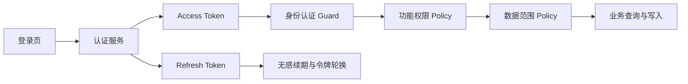

# 企业级账号、角色与权限体系设计

**日期：** 2026-07-30

**状态：** 已确认

**适用工程：** `rd-manager-workbench`

**目标版本：** 企业级单组织多人使用基础版

## 1. 背景与目标

当前系统仍按“本地单人工作台”运行，没有真实账号身份、登录会话和后端数据权限。前端菜单和业务接口默认可以访问全部数据，无法满足多人使用时的数据隔离与管理要求。

本次改造目标：

1. 增加登录、退出、修改密码、管理员重置密码和会话管理。
2. 用户账号与现有员工档案一一绑定。
3. 增加用户管理、角色管理、权限管理和安全审计。
4. 超级管理员拥有所有功能和全部数据权限。
5. 普通员工只能查看、编辑自己创建、负责、参与或被共享的数据。
6. 支持项目经理、部门主管、HR 等自定义角色及数据范围。
7. Access Token 过期时自动刷新，不打断业务操作。
8. 权限由后端强制执行，前端菜单与按钮隐藏只负责改善体验。
9. 取消“项目进展草稿”独立入口，将待确认进展归入项目详情。

## 2. 产品边界

### 2.1 账号与员工

- 一个用户账号必须绑定一个员工档案 `ResourceProfile`。
- 一个员工档案最多绑定一个有效用户账号。
- 员工档案保存组织与业务属性；用户账号保存认证、安全状态和权限分配。
- 归档员工不等于删除账号。归档员工时，系统要求管理员确认是否同步停用账号。
- 永久删除员工前，必须先停用并删除账号，且完成业务数据归属转移。

### 2.2 登录方式

第一版采用“账号或工号 + 密码”：

- 管理员创建账号并生成临时密码。
- 用户首次登录必须修改密码。
- 忘记密码由管理员重置。
- 第一版不依赖短信或邮箱完成登录和找回密码。
- 手机号、企业邮箱、LDAP、OIDC 和企业单点登录作为后续扩展。

### 2.3 角色模型

采用“内置角色 + 自定义角色”：

- `SUPER_ADMIN`：系统内置超级管理员，拥有所有权限和全部数据范围。
- `EMPLOYEE`：系统内置普通员工，仅访问本人及参与数据。
- 项目经理模板：访问本人负责项目及项目内相关数据。
- 部门主管模板：访问本部门员工、计划、周报、资源负荷和授权项目。
- HR/人员管理员模板：管理员工档案和人员统计，不自动获得项目文档权限。
- 管理员可复制模板并创建自定义角色。
- 一个用户可以拥有多个角色，最终权限取并集。

## 3. 权限架构

系统采用 RBAC 功能权限与数据范围控制结合的模式。

### 3.1 功能权限

权限编码采用稳定的 `<resource>.<action>`：

- `user.read`、`user.create`、`user.update`、`user.disable`
- `role.read`、`role.create`、`role.update`、`role.assign`
- `employee.read`、`employee.update`、`employee.archive`、`employee.delete`
- `project.read`、`project.create`、`project.update`、`project.delete`
- `task.read`、`task.create`、`task.update`、`task.delete`
- `document.read`、`document.create`、`document.update`、`document.share`
- `report.read`、`report.export`
- `backup.execute`、`restore.execute`
- `audit.read`、`system.configure`

后端维护系统权限目录。管理员可以为角色勾选权限，但不能创建任意权限编码或删除系统正在使用的权限。

### 3.2 数据范围

| 编码 | 含义 |
|---|---|
| `SELF` | 自己创建或负责的数据 |
| `INVOLVED` | 自己创建、负责、执行、参与或被共享的数据 |
| `DEPARTMENT` | 所在部门及下属组织的数据 |
| `PROJECT` | 被授权或负责项目范围内的数据 |
| `ALL` | 全部数据 |

同一用户拥有多个角色时，数据范围取并集。`ALL` 只能通过明确授权的管理员角色获得。

### 3.3 后端强制执行

- 除登录、刷新、退出、健康检查外，所有业务接口默认需要登录。
- 控制器入口校验功能权限。
- Service/Repository 查询拼接数据范围条件，禁止读取全部数据后由前端过滤。
- 单条详情、修改、删除和下载接口再次校验对象级访问权。
- 搜索、报表、导出、Socket 推送和 NOVA 知识检索使用相同数据范围。
- 前端路由、菜单和按钮权限不能替代后端权限判断。

## 4. 数据模型

### 4.1 新增模型

#### User

- `id`
- `username`：全局唯一，大小写归一化
- `employeeNo`：可作为登录标识，存在时唯一
- `passwordHash`
- `status`：`PENDING`、`ACTIVE`、`DISABLED`、`LOCKED`
- `mustChangePassword`
- `failedLoginCount`
- `lockedUntil`
- `passwordChangedAt`
- `lastLoginAt`
- `resourceProfileId`：与员工档案一一绑定
- `createdAt`、`updatedAt`

#### Role

- `id`、`code`、`name`、`description`
- `isSystem`、`isEnabled`
- `createdAt`、`updatedAt`

#### Permission

- `id`、`code`
- `module`、`resource`、`action`
- `description`、`isSensitive`

#### UserRole

- `userId`、`roleId`
- `assignedByUserId`、`assignedAt`

#### RolePermission

- `roleId`、`permissionId`
- `dataScope`
- `scopeConfig`：部门、项目等扩展范围

#### AuthSession

- `id`、`userId`
- `refreshTokenHash`、`tokenFamilyId`
- `deviceName`、`userAgent`、`ipAddress`
- `expiresAt`、`lastUsedAt`
- `revokedAt`、`revokeReason`
- `createdAt`

#### LoginAudit

- `id`、`userId`、`username`
- `eventType`、`success`、`failureReason`
- `ipAddress`、`userAgent`、`sessionId`
- `occurredAt`

### 4.2 业务归属

主要业务实体按语义补充：

- `createdByUserId`
- `updatedByUserId`
- `ownerUserId`
- `visibility`
- 参与人多对多关系

文档与知识库额外支持用户共享、角色共享、所属项目，以及 `PRIVATE`、`INVOLVED`、`ORGANIZATION` 可见性。

不能机械地给所有表增加完全相同的字段。每个模块根据业务语义选择创建人、负责人、参与人或共享关系，并接入统一授权接口。

## 5. Token 与登录会话

### 5.1 Token 策略

- Access Token 默认 15 分钟，只保存在前端内存，不写入 `localStorage`。
- Refresh Token 默认 7 天；勾选“保持登录”时最长 30 天。
- Refresh Token 通过 `HttpOnly` Cookie 传递。
- 数据库只保存 Refresh Token 哈希。
- 每次刷新都轮换 Refresh Token。
- 旧 Refresh Token 再次出现时，撤销同一 Token Family 的全部会话。

### 5.2 无感刷新

1. 请求自动附带当前 Access Token。
2. 收到可刷新的 401 时进入单例刷新流程。
3. 同一时间只有一个刷新请求，其余失败请求排队。
4. 刷新成功后更新内存 Token，并重放原请求。
5. 刷新失败时清理身份状态并跳转登录。
6. 跳转前记录当前路由，重新登录后返回原页面。
7. 账号停用、会话撤销、密码变更等不可刷新状态不循环重试。

上传、下载、SSE、WebSocket 和 AI 流式接口必须纳入认证：

- 上传、普通下载使用 Access Token。
- 受保护下载不得依赖可复制的永久 URL。
- SSE 使用短期连接票据或受控认证参数，避免长期 Token 暴露在 URL。
- WebSocket 握手时认证，并在权限版本变化时重新校验。

### 5.3 Cookie 与 CSRF

- Refresh Cookie 使用 `HttpOnly`、适当的 `SameSite` 与路径限制。
- 浏览器和 Electron 允许来源通过配置明确列出。
- 刷新、退出等 Cookie 状态变更请求增加 CSRF 防护。
- Electron 正式包不得关闭 Web 安全策略绕过认证配置。

## 6. 页面与交互

### 6.1 登录和个人安全

- 登录页：账号/工号、密码、保持登录、错误提示。
- 首次登录修改密码页。
- 个人安全页：修改密码、查看设备、退出指定设备、退出全部设备。
- 403 无权限页。
- 账号停用、账号锁定、会话过期分别显示明确原因。

### 6.2 系统管理

新增“系统管理”一级入口，只向具备权限的用户展示。

#### 用户管理

- 搜索和筛选账号状态、部门、角色。
- 创建账号并绑定员工。
- 分配角色、启用或停用账号。
- 重置临时密码并强制首次登录修改。
- 强制退出指定设备或全部设备。
- 查看最近登录和安全状态。

#### 角色管理

- 新建、复制、编辑和停用自定义角色。
- 查看系统内置角色。
- 按模块配置查看、新建、编辑、删除、导入、导出、审批、管理权限。
- 为权限配置数据范围。
- 展示角色影响的用户数量。
- 删除角色前要求转移已有用户。

#### 权限查看

- 按模块查看系统权限矩阵、权限说明和敏感级别。
- 权限目录只读，不提供任意创建或删除系统权限的入口。

#### 会话与审计

- 查看活跃设备、登录时间、最近使用时间和 IP。
- 管理员撤销指定会话。
- 查看登录成功、失败、刷新、退出、密码重置、角色调整和越权拦截记录。

### 6.3 管理员与普通用户

- 超级管理员默认使用全局管理视角。
- 管理员可以查看、编辑所有员工及业务对象。
- 普通员工只看到有权限的菜单、数据和操作。
- 页面不复制管理员版和员工版，统一由权限和数据范围控制。
- 管理员查看他人数据时，页面显示当前数据归属。

## 7. 模块数据权限

| 模块 | 普通员工默认范围 | 管理员 |
|---|---|---|
| 我的工作、提醒、日历 | 仅本人 | 全部或按用户筛选 |
| 员工档案 | 本人非敏感资料 | 全部查看和维护 |
| 周计划、周报、工作明细 | 本人提交和维护 | 全部查看、编辑、导入 |
| 项目 | 负责、参与或被授权项目 | 全部 |
| 任务、里程碑、风险、进展 | 有权项目内且本人相关的数据 | 全部 |
| 会议 | 组织、参与或被共享会议 | 全部 |
| 文档、知识库 | 自己创建、被共享或组织公开 | 全部 |
| 多维表格 | 自己创建、被共享或关联项目可见 | 全部 |
| 报表、资源负荷 | 本人；主管按部门 | 全部 |
| 行业情报 | 组织公开或本人维护内容 | 全部 |
| 备份、恢复、审计、系统设置 | 默认无权限 | 管理员或专门授权角色 |

有权访问项目不代表自动拥有项目内所有敏感文档，文档可见性和共享范围仍需独立校验。

## 8. 项目进展草稿调整

取消员工模块中的“项目进展草稿”独立入口：

1. 员工提交个人周报和工作进展。
2. 系统按项目汇总生成“待确认进展建议”。
3. 建议进入项目详情的“进展”页。
4. 项目负责人、具有进展发布权限的角色或管理员可以查看和修改。
5. 确认后发布为正式项目进展，并进入活动时间线和报表。
6. 普通员工只查看自己的贡献及有权访问的已发布进展。

旧草稿数据不删除，迁移为项目下的待确认进展。

## 9. 历史数据迁移

### 9.1 初始化

1. 升级期间创建首个超级管理员。
2. 超级管理员绑定指定的现有员工档案。
3. 初始化系统权限、内置角色和角色权限。
4. 归属迁移完成前禁止普通用户登录。

### 9.2 归属推断

- 通过员工 ID、负责人或唯一员工姓名可准确识别的数据，绑定对应用户。
- 无法可靠识别的数据归首个超级管理员，并标记“待分配归属”。
- 不因无法识别归属而删除、隐藏或跳过历史数据。
- 提供“历史数据归属校正”管理页，支持批量分配负责人。
- 每次归属变更写入审计日志。

### 9.3 迁移验证

- 迁移前后各业务表记录总数一致。
- 员工、项目、任务、会议、文档、周报和知识索引抽样核对。
- 所有未归属记录均有可查询的迁移状态。
- 普通用户启用前执行越权访问回归测试。

## 10. 安全规则

- 密码使用 Argon2id 哈希。
- 密码至少 10 位，并同时包含字母和数字。
- 同一账号连续失败 5 次后锁定 15 分钟。
- 修改密码、重置密码、账号停用后立即撤销全部会话。
- 超级管理员权限不可被普通管理员移除。
- 系统始终至少保留一个可登录的超级管理员。
- 用户管理、角色调整、永久删除、导出、备份和恢复全部审计。
- 登录接口限流，并避免通过错误提示泄露账号是否存在。
- 日志不得记录密码、Token、Cookie 或完整数据库连接信息。

## 11. 权限变化实时同步

- 登录响应包含权限集合、数据范围摘要和权限版本。
- 管理员修改角色或权限后，后端递增相关用户的权限版本。
- 在线用户通过 Socket 收到权限变化通知。
- 前端重新获取当前用户和权限，刷新菜单及缓存。
- 被撤销关键权限或停用账号时，当前会话立即失效。
- 后端每次请求仍独立校验权限，不能只依赖前端缓存版本。

## 12. 错误处理

| 场景 | 处理 |
|---|---|
| Access Token 正常过期 | 自动刷新并重放原请求 |
| 多请求同时返回 401 | 单例刷新，其余请求排队 |
| Refresh Token 过期 | 跳转登录并保留原路由 |
| Refresh Token 重放 | 撤销 Token Family，要求重新登录 |
| 账号停用 | 显示停用原因，不循环刷新 |
| 权限不足 | 返回 403 并显示明确无权限页面 |
| 数据不属于当前用户 | 后端拒绝访问并记录必要审计 |
| 网络暂时不可用 | 保留身份状态，恢复后重试 |
| 角色刚被修改 | Socket 通知后重新拉取权限 |

## 13. 测试与验收

### 13.1 后端

- 密码哈希与验证。
- 登录失败锁定和解锁。
- Token 签发、轮换、过期和重放。
- 用户、角色、权限 CRUD 与系统角色保护。
- 各业务模块功能权限。
- SELF、INVOLVED、DEPARTMENT、PROJECT、ALL 数据范围。
- 详情、修改、删除、下载、搜索、导出、AI 检索越权。
- 账号停用和权限变化立即生效。
- 历史数据归属迁移与回滚。

### 13.2 前端

- 登录、首次修改密码和退出。
- 401 单例刷新和请求重放。
- 刷新失败回到登录并恢复原路由。
- 菜单、路由和操作按钮权限。
- 用户、角色、权限矩阵和会话管理。
- 403、账号停用、锁定和网络错误状态。

### 13.3 端到端

1. 超级管理员查看和编辑任意员工数据。
2. 普通员工只查看和编辑自己的数据。
3. 普通员工修改 URL 或直接调用 API 不能访问他人数据。
4. 项目经理管理负责项目但不能访问无关项目。
5. 部门主管查看本部门周报但不能跨部门访问。
6. Token 过期时正在编辑的内容不丢失。
7. 账号停用或强制退出后旧 Token 立即不可用。
8. 角色权限修改实时生效。
9. 文档下载、搜索、报表和 NOVA 检索不泄露无权数据。
10. 历史数据迁移前后总量一致。

## 14. 实施分期

### P0-A：认证基础

- User、AuthSession、LoginAudit 数据模型
- 首个超级管理员初始化
- 登录、刷新、退出、修改密码
- 前端身份状态、登录页和无感刷新
- 全局默认认证 Guard

### P0-B：用户、角色和权限

- Role、Permission、UserRole、RolePermission
- 用户管理、角色管理、权限矩阵
- 功能权限 Guard 与统一 Policy 接口
- 会话管理、安全审计

### P0-C：核心数据隔离

- 员工、周报、项目、任务、里程碑、风险、进展
- 我的工作、日历和提醒
- 搜索、报表和导出权限过滤
- 历史数据归属迁移

### P1-A：内容与协作对象权限

- 会议、文档、知识库、多维表格
- 用户/角色共享
- 下载、索引和 NOVA 检索权限

### P1-B：管理扩展

- 部门主管、项目经理、HR 模板
- 权限实时变更
- 历史数据归属校正页
- 登录与权限安全报表

### P1-C：项目进展入口调整

- 移除员工模块独立“项目进展草稿”入口
- 迁移旧草稿为项目“待确认进展”
- 项目负责人/管理员确认发布

## 15. 非目标

本次不实现：

- 多企业租户隔离。
- 手机验证码登录和邮箱找回密码。
- LDAP、OIDC、SAML 或飞书单点登录。
- 外部互联网账号注册。
- 每个对象任意配置复杂 ACL 的完整策略引擎。
- 即时聊天和组织通讯录同步。

这些能力可以建立在本次用户、角色、权限和会话基础之上继续扩展。
